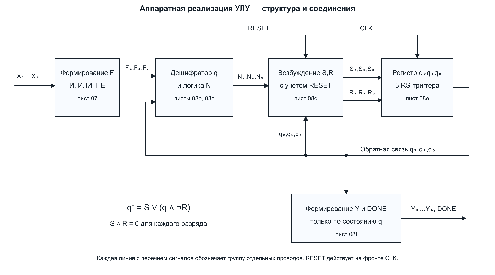
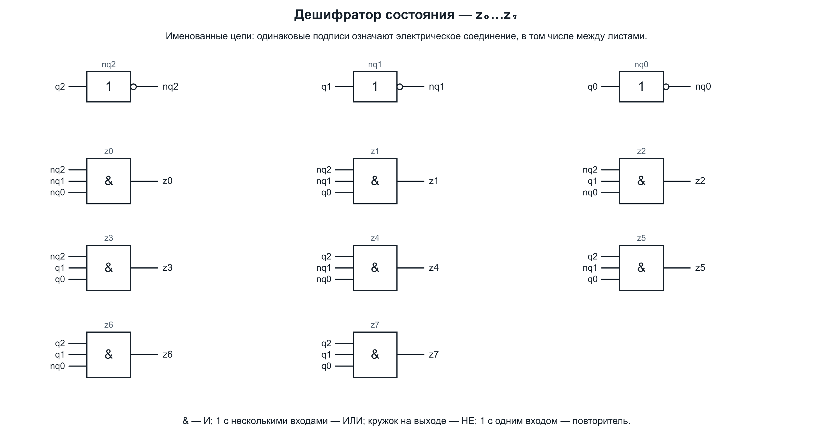
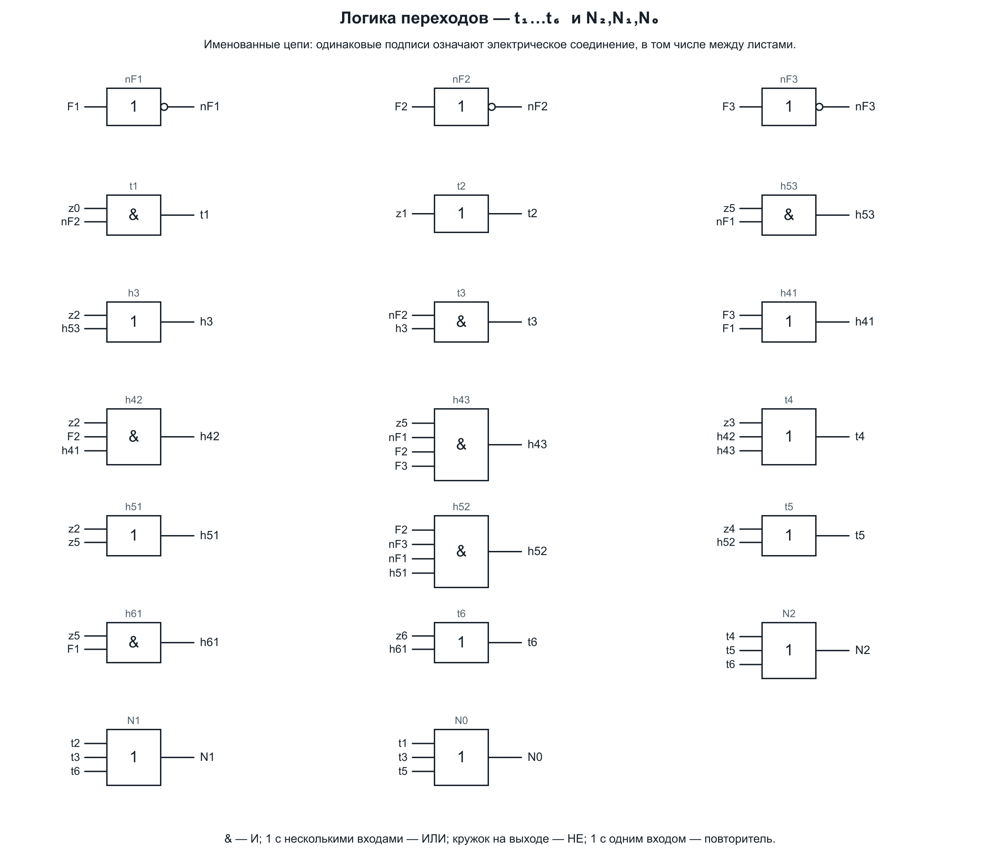
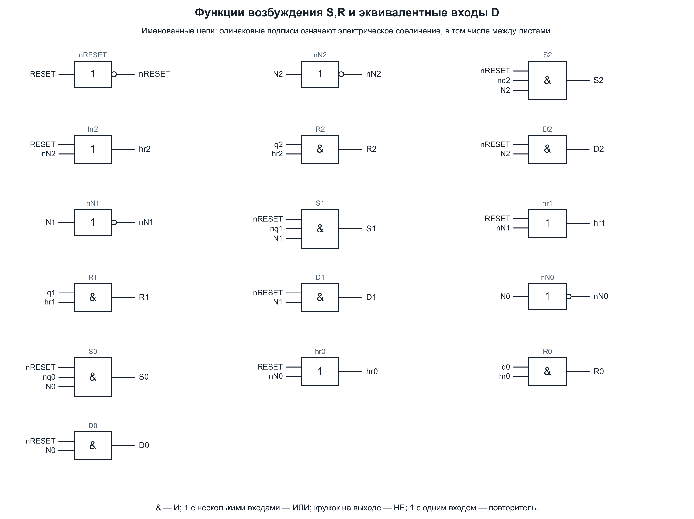
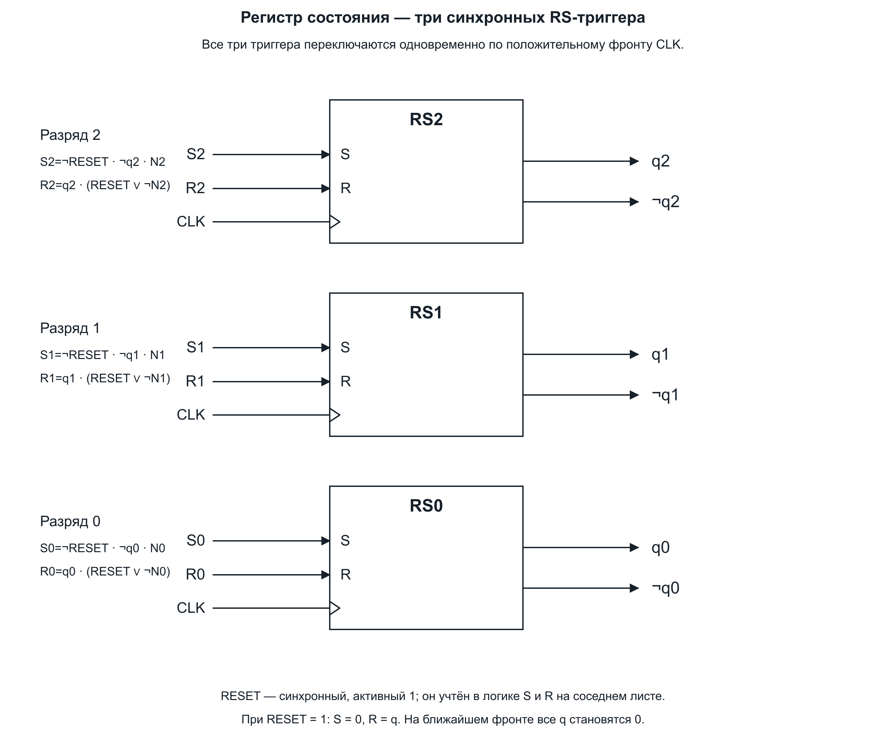
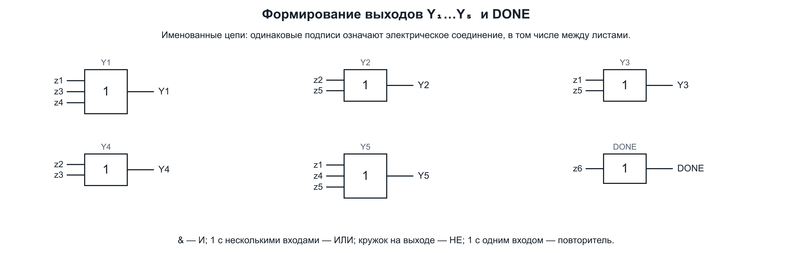

# 8 Канонический структурный синтез управляющего автомата

Аппаратная реализация получена в последовательности: кодирование состояний, таблица переходов, функции следующего состояния, функции возбуждения памяти, функции выходов, схема вентилей и регистра. Это соответствует общей последовательности структурного синтеза из раздела 3.2 [методических указаний ОГУ](https://elib.osu.ru/bitstream/123456789/8908/1/1825_20110825.pdf).

Реализация рассчитана на основной граф с отдельным конечным состоянием S6. В модели приняты синхронные RS-триггеры с положительным фронтом CLK и активными единицей входами установки и сброса. Уравнения описывают установившиеся цифровые уровни до фронта.

## 8.1 Память и кодирование

Требуется семь состояний, поэтому число двоичных элементов памяти равно:

$$m=\lceil\log_2 7\rceil=3.$$

Используется прямое кодирование: S0=000, S1=001, S2=010, S3=011, S4=100, S5=101, S6=110. Код 111 не используется; при его обнаружении на ближайшем такте происходит переход в 000. Выходы для 111 равны нулю. При RESET=1 любой код переходит в 000.

Порядок битов — q2,q1,q0 от старшего к младшему. Начальное значение регистра в программе — 000. В физической схеме это значение следует установить сигналом RESET на фронте CLK.

Имена необходимо различать: **S0..S6 в графе — названия состояний; S2,S1,S0 на входах RS-триггеров — сигналы Set соответствующих разрядов**. Для проверки текущего состояния в комбинационной схеме введены отдельные сигналы z0..z7, поэтому они не смешиваются с входами установки.

## 8.2 Дешифратор состояний

Введём z_j=1 тогда и только тогда, когда q2q1q0 равно двоичному коду j:

$$\begin{aligned}
z_0&=\overline q_2\overline q_1\overline q_0,&z_1&=\overline q_2\overline q_1q_0,\\
z_2&=\overline q_2q_1\overline q_0,&z_3&=\overline q_2q_1q_0,\\
z_4&=q_2\overline q_1\overline q_0,&z_5&=q_2\overline q_1q_0,\\
z_6&=q_2q_1\overline q_0,&z_7&=q_2q_1q_0.
\end{aligned}$$

При каждом допустимом двоичном коде ровно один сигнал z равен 1. Инверсии `nq2,nq1,nq0` в файлах схем означают ¬q2,¬q1,¬q0.

## 8.3 Таблица переходов и возбуждения

### Аппаратная реализация управляющего автомата УЛУ

Сводная таблица оформлена по образцу пользователя. Для каждой дуги основного графа приведены начальное и конечное состояния, их коды, условие по F, активные выходы Y и активные входы возбуждения RS. **RESET=0; выходы Y относятся к начальному состоянию строки, до фронта CLK.**

<!-- hardware-table:start -->
| Начальное состояние | Код начального состояния | Конечное состояние | Код конечного состояния | Входные сигналы Fi | Выходные сигналы Yj | Функция возбуждения RS |
| --- | --- | --- | --- | --- | --- | --- |
| S0 | 000 | S0 | 000 | F2 | — | — |
| S0 | 000 | S1 | 001 | ¬F2 | — | S0 |
| S1 | 001 | S2 | 010 | 1 | Y1 Y3 Y5 | S1 R0 |
| S2 | 010 | S3 | 011 | ¬F2 | Y2 Y4 | S0 |
| S2 | 010 | S4 | 100 | F2(F3∨F1) | Y2 Y4 | S2 R1 |
| S2 | 010 | S5 | 101 | F2¬F3¬F1 | Y2 Y4 | S2 R1 S0 |
| S3 | 011 | S4 | 100 | 1 | Y1 Y4 | S2 R1 R0 |
| S4 | 100 | S5 | 101 | 1 | Y1 Y5 | S0 |
| S5 | 101 | S3 | 011 | ¬F1¬F2 | Y2 Y3 Y5 | R2 S1 |
| S5 | 101 | S4 | 100 | ¬F1F2F3 | Y2 Y3 Y5 | R0 |
| S5 | 101 | S5 | 101 | ¬F1F2¬F3 | Y2 Y3 Y5 | — |
| S5 | 101 | S6 | 110 | F1 | Y2 Y3 Y5 | S1 R0 |
| S6 | 110 | S6 | 110 | 1 | — | — |
| Неисп. | 111 | S0 | 000 | 1 | — | R2 R1 R0 |
<!-- hardware-table:end -->

Знак `¬` означает НЕ, соседство F — И, `∨` — ИЛИ; `1` в столбце Fi означает переход при любом наборе F. Знак `—` означает, что все соответствующие сигналы равны нулю. В последнем столбце перечислены только единичные входы S/R, остальные равны нулю.

Индексы S/R совпадают с индексами разрядов схемы: **S2/R2 → q2, S1/R1 → q1, S0/R0 → q0**. Например, переход S1→S2 меняет код 001 на 010: устанавливается q1 и сбрасывается q0, поэтому возбуждение равно `S1 R0`. В столбцах состояний S1 — имя состояния, в столбце RS — вход установки разряда q1.

Последняя строка описывает восстановление неиспользуемого кода 111. Состояние S6 удерживается до синхронного RESET. При RESET=1 из любого кода выполняется переход в S0: все S равны нулю, Rk=qk; значения F произвольны. Переход S5→S4 сохранён для формального набора F=011, хотя такой набор не формируется реальными F(X).

[Таблица для вставки в отчёт (PNG)](../diagrams/08g_hardware_table.png) • [Редактируемый SVG](../diagrams/08g_hardware_table.svg) • [Данные JSON](../data/hardware_implementation.json)

Таблица автоматически пересоздаётся `scripts/build_data.py` и проверяется по независимому интерпретатору, выходам и входам RS схемы на всех 64 сочетаниях кода состояния и формального F.

### Развёрнутые значения входов RS

Для RS-триггера используется следующий выбор сигналов:

| q | q⁺ | S | R | Действие |
|---|---|---|---|---|
| 0 | 0 | 0 | 0 | Удержать 0 |
| 0 | 1 | 1 | 0 | Установить 1 |
| 1 | 0 | 0 | 1 | Сбросить 0 |
| 1 | 1 | 0 | 0 | Удержать 1 |

В следующей таблице RESET=0, пары SR относятся к одному разряду и записаны в порядке Set,Reset. При удержании выбран именно 00.

| Переход | Коды | Условие | S2 R2 | S1 R1 | S0 R0 |
|---|---|---|---|---|---|
| S0→S0 | 000→000 | F2 | 00 | 00 | 00 |
| S0→S1 | 000→001 | ¬F2 | 00 | 00 | 10 |
| S1→S2 | 001→010 | 1 | 00 | 10 | 01 |
| S2→S3 | 010→011 | ¬F2 | 00 | 00 | 10 |
| S2→S4 | 010→100 | F2(F3∨F1) | 10 | 01 | 00 |
| S2→S5 | 010→101 | F2¬F3¬F1 | 10 | 01 | 10 |
| S3→S4 | 011→100 | 1 | 10 | 01 | 01 |
| S4→S5 | 100→101 | 1 | 00 | 00 | 10 |
| S5→S3 | 101→011 | ¬F1¬F2 | 01 | 10 | 00 |
| S5→S4 | 101→100 | ¬F1F2F3 | 00 | 00 | 01 |
| S5→S5 | 101→101 | ¬F1F2¬F3 | 00 | 00 | 00 |
| S5→S6 | 101→110 | F1 | 00 | 10 | 01 |
| S6→S6 | 110→110 | 1 | 00 | 00 | 00 |
| 111→S0 | 111→000 | 1 | 01 | 01 | 01 |

Полная [таблица возбуждения CSV](../data/excitation_table.csv) содержит все 64 комбинации кода состояния и формального набора F. Выходы для исходных состояний приведены в [таблице состояний](../data/states.csv).

## 8.4 Канонические функции перехода

Обозначим через t_j логическое условие того, что следующим состоянием будет S_j, при RESET=0. Для каждого назначения суммируются все входящие в него переходы:

$$\begin{aligned}
t_0&=z_0F_2\vee z_7,\\
t_1&=z_0\overline{F_2},\\
t_2&=z_1,\\
t_3&=\overline{F_2}(z_2\vee z_5\overline{F_1}),\\
t_4&=z_3\vee z_2F_2(F_3\vee F_1)\vee z_5\overline{F_1}F_2F_3,\\
t_5&=z_4\vee F_2\overline{F_3}\overline{F_1}(z_2\vee z_5),\\
t_6&=z_6\vee z_5F_1.
\end{aligned}$$

Например, t3 объединяет дугу S2→S3 и дугу S5→S3. t6 объединяет достижение конца из S5 и удержание конечного состояния. Для каждого кода и набора F ровно один из t0..t6 равен 1.

Разряды следующего кода образуются объединением тех t, в которых соответствующий бит равен единице:

$$\boxed{N_2=t_4\vee t_5\vee t_6}$$
$$\boxed{N_1=t_2\vee t_3\vee t_6}$$
$$\boxed{N_0=t_1\vee t_3\vee t_5}$$

Например, старший бит равен 1 у кодов 100,101,110, поэтому N2=t4∨t5∨t6. При t0=1 все три N равны нулю, отдельный вентиль t0 для кодирования следующего состояния не требуется. Аналогично z7 не имеет потребителей, но показан как полный выход дешифратора для контроля неиспользуемого кода.

Вспомогательные h-цепи на схеме раскрывают скобки этих выражений: h53=z5¬F1, h3=z2∨h53, h41=F3∨F1, h42=z2F2h41, h43=z5¬F1F2F3, h51=z2∨z5, h52=F2¬F3¬F1h51, h61=z5F1.

Эта форма сохраняет общие подвыражения. Для функций перехода заявляется корректность и канонический способ получения; отдельный глобальный минимум количества вентилей не заявляется.

## 8.5 Функции возбуждения RS и сброс

Подробный [вывод всех шести функций S/R через α1,α2,α3 с подстановкой кодов и упрощениями](08h_output_rs_derivation.md) оформлен отдельно. Соответствие разрядов: α1=q2, α2=q1, α3=q0. Обозначения Sα1/Rα1 в решении соответствуют S2/R2 на схеме, Sα2/Rα2 — S1/R1, Sα3/Rα3 — S0/R0.

Для каждого k=2,1,0 выбраны:

$$\boxed{S_k=\overline{RESET}\;\overline q_kN_k}$$
$$\boxed{R_k=q_k(RESET\vee\overline{N_k})}$$

Без сброса формулы дают 10 при переходе 0→1, 01 при 1→0, 00 при удержании. Сброс выключает все S и задаёт R=q, поэтому на ближайшем фронте регистр становится 000.

Запрещённое сочетание невозможно в установившейся логике:

$$S_kR_k=\overline{RESET}\;\overline q_kN_k\;q_k(RESET\vee\overline{N_k})=0,$$

поскольку q_k и ¬q_k не могут одновременно равняться 1. Характеристическое уравнение каждого триггера:

$$q_k^+=S_k\vee(q_k\overline{R_k}).$$

Подстановка даёт q_k⁺=N_k при RESET=0 и q_k⁺=0 при RESET=1.

Для эквивалентной реализации на D-триггерах также выведены D_k=¬RESET·N_k. Они показаны на листе возбуждения как альтернатива; в основной модели памяти используются RS-триггеры.

Подписи цепей на разных листах связывают их между собой. CLK — один общий тактовый сигнал для всех трёх триггеров. В программе сначала рассчитываются все S/R по старому состоянию, затем одновременно обновляются три q. Последовательное обновление с перерасчётом логики между разрядами дало бы другую схему.

## 8.6 Функции выходов

Полное решение для каждого Y, от активных состояний до сокращённой формулы в обозначениях α, приведено в [выводе функций выходов и возбуждения RS](08h_output_rs_derivation.md) и [PDF для печати](../output/pdf/ALM_variant5_output_rs_derivation.pdf).

По таблице выходов состояний получены:

$$\begin{aligned}
Y_1&=z_1\vee z_3\vee z_4,\\
Y_2&=z_2\vee z_5,\\
Y_3&=z_1\vee z_5,\\
Y_4&=z_2\vee z_3,\\
Y_5&=z_1\vee z_4\vee z_5.
\end{aligned}$$

Служебный сигнал DONE=z6 показывает завершение и не входит в заданный набор Y1..Y5.

Выходы используют только q через z и не зависят непосредственно от F или X. Это сохраняет тип Мура. Для S0,S6 и кода 111 все пять Y равны нулю.

При непосредственной реализации по q эквивалентные сокращённые формы имеют вид:

$$\begin{aligned}
Y_1&=\overline q_2q_0\vee q_2\overline q_1\overline q_0,\\
Y_2&=\overline q_2q_1\overline q_0\vee q_2\overline q_1q_0,\\
Y_3&=\overline q_1q_0,\\
Y_4&=\overline q_2q_1,\\
Y_5&=\overline q_1(q_2\vee q_0).
\end{aligned}$$

В основной схеме используется уже имеющийся дешифратор z. Обе формы корректны и для неиспользуемого кода 111.

## 8.7 Как перейти к учебной циклической реализации

В циклическом варианте конец возвращает в S0, а 110 и 111 становятся неиспользуемыми кодами. Для этого достаточно заменить t6 на 0 и t0 на z0F2∨z5F1∨z6∨z7. Остальные t1..t5 и формулы S/R сохраняются. Тогда N2=t4∨t5, N1=t2∨t3, N0=t1∨t3∨t5. Выходные функции неизменны.

DONE=z6 в таком варианте не подходит: событие окончания одного цикла определяется переходом из S5 при F1=1. Оно помечается в поведенческой модели полем `cycle_completed`. В основной модели DONE — удерживаемый выход конечного состояния.

[Полный список вентилей](../data/gate_netlist.json) • [Python-модель схемы](../ulu/netlist.py) • [Далее: запуск программы](09_python.md)
