# Все схемы варианта 5

Каждый рисунок доступен в PNG для просмотра и SVG для редактирования. Основная аппаратная схема соответствует остановке в S6. Циклические варианты явно подписаны.

[Скачать единый PDF-альбом](../output/ALM_variant5_schemes.pdf)

| Схема | Просмотр | Редактирование |
|---|---|---|
| Исходная блок-схема | [PNG](../diagrams/01_flowchart.png) | [SVG](../diagrams/01_flowchart.svg) |
| Блок-схема с обозначениями A и B | [PNG](../diagrams/02_flowchart_labeled.png) | [SVG](../diagrams/02_flowchart_labeled.svg) |
| ЛСА | [PNG](../diagrams/03_lsa.png) | [SVG](../diagrams/03_lsa.svg) |
| Отмеченная ГСА с остановкой в S6 | [PNG](../diagrams/04_marked_gsa.png) | [SVG](../diagrams/04_marked_gsa.svg) |
| Учебная циклическая отмеченная ГСА | [PNG](../diagrams/04b_marked_gsa_cyclic.png) | [SVG](../diagrams/04b_marked_gsa_cyclic.svg) |
| Основной граф Мура | [PNG](../diagrams/05_moore_graph.png) | [SVG](../diagrams/05_moore_graph.svg) |
| Граф с учётом достижимых F(X) | [PNG](../diagrams/05b_moore_reachable.png) | [SVG](../diagrams/05b_moore_reachable.svg) |
| Учебный циклический граф Мура | [PNG](../diagrams/05c_moore_cyclic.png) | [SVG](../diagrams/05c_moore_cyclic.svg) |
| Карта Карно F1 | [PNG](../diagrams/06a_kmap_F1.png) | [SVG](../diagrams/06a_kmap_F1.svg) |
| Карта Карно F2 | [PNG](../diagrams/06b_kmap_F2.png) | [SVG](../diagrams/06b_kmap_F2.svg) |
| Карта Карно F3 | [PNG](../diagrams/06c_kmap_F3.png) | [SVG](../diagrams/06c_kmap_F3.svg) |
| Схема формирования F1,F2,F3 | [PNG](../diagrams/07_input_logic.png) | [SVG](../diagrams/07_input_logic.svg) |
| Общая аппаратная схема | [PNG](../diagrams/08a_hardware_overview.png) | [SVG](../diagrams/08a_hardware_overview.svg) |
| Дешифратор состояний | [PNG](../diagrams/08b_state_decoder.png) | [SVG](../diagrams/08b_state_decoder.svg) |
| Аппаратная реализация управляющего автомата УЛУ — таблица | [PNG](../diagrams/08g_hardware_table.png) | [SVG](../diagrams/08g_hardware_table.svg) |
| Логика переходов | [PNG](../diagrams/08c_transition_logic.png) | [SVG](../diagrams/08c_transition_logic.svg) |
| Функции возбуждения RS и альтернативные D | [PNG](../diagrams/08d_excitation_logic.png) | [SVG](../diagrams/08d_excitation_logic.svg) |
| Три синхронных RS-триггера | [PNG](../diagrams/08e_register.png) | [SVG](../diagrams/08e_register.svg) |
| Формирование Y и DONE | [PNG](../diagrams/08f_output_logic.png) | [SVG](../diagrams/08f_output_logic.svg) |
| Временная диаграмма тестового сценария | [PNG](../diagrams/09_timing.png) | [SVG](../diagrams/09_timing.svg) |

## Исходная блок-схема

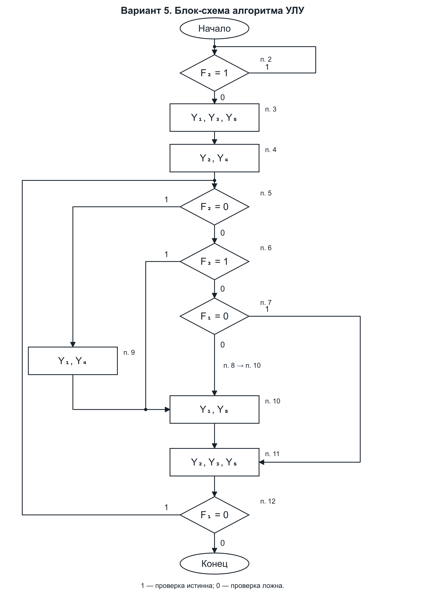

## Блок-схема с обозначениями A и B

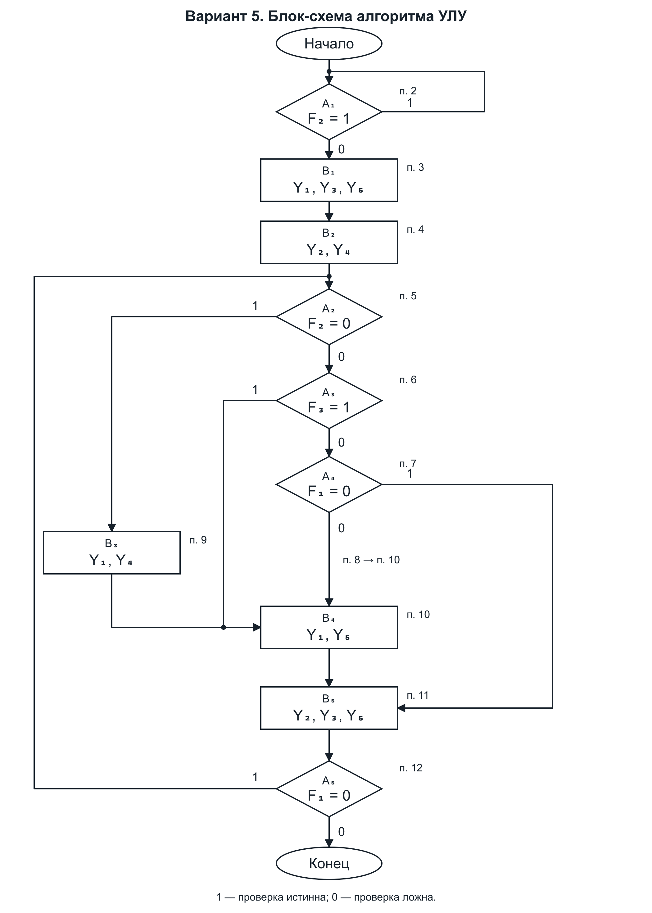

## ЛСА

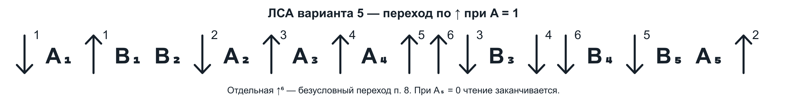

## Отмеченная ГСА с остановкой в S6

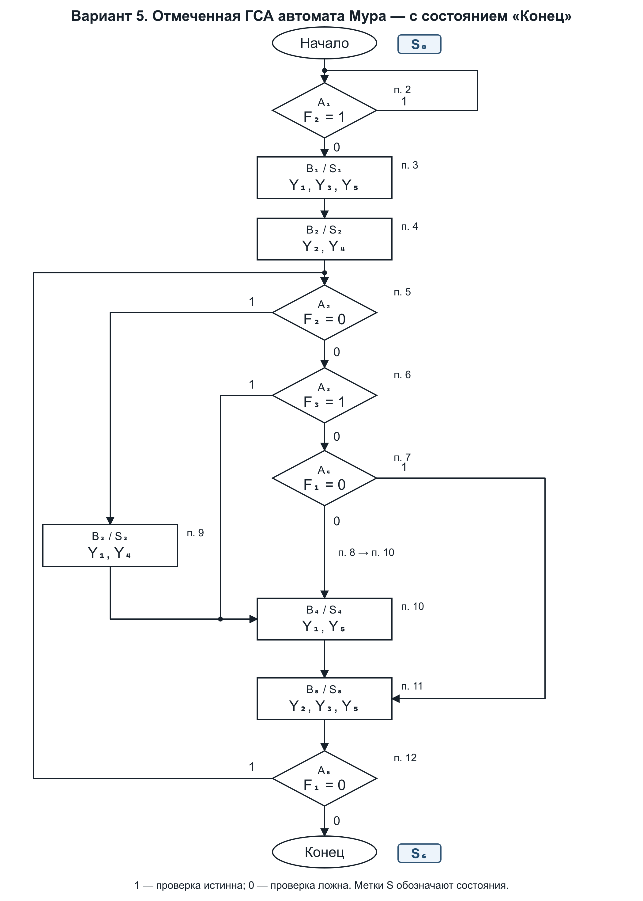

## Учебная циклическая отмеченная ГСА

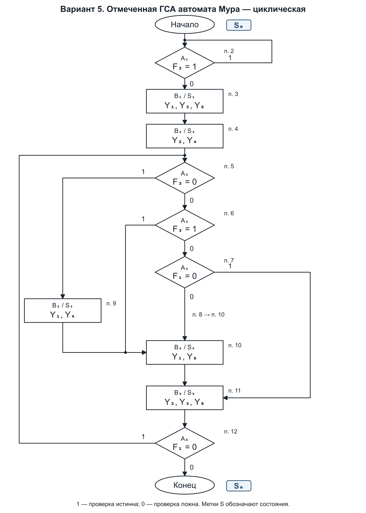

## Основной граф Мура

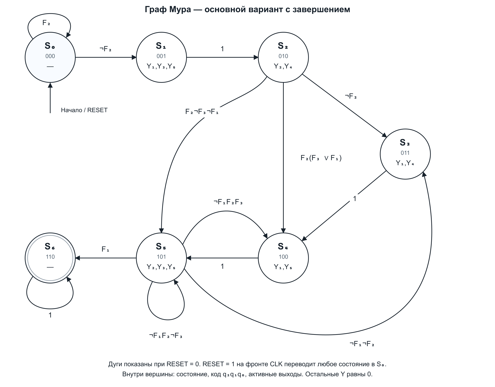

## Граф с учётом достижимых F(X)

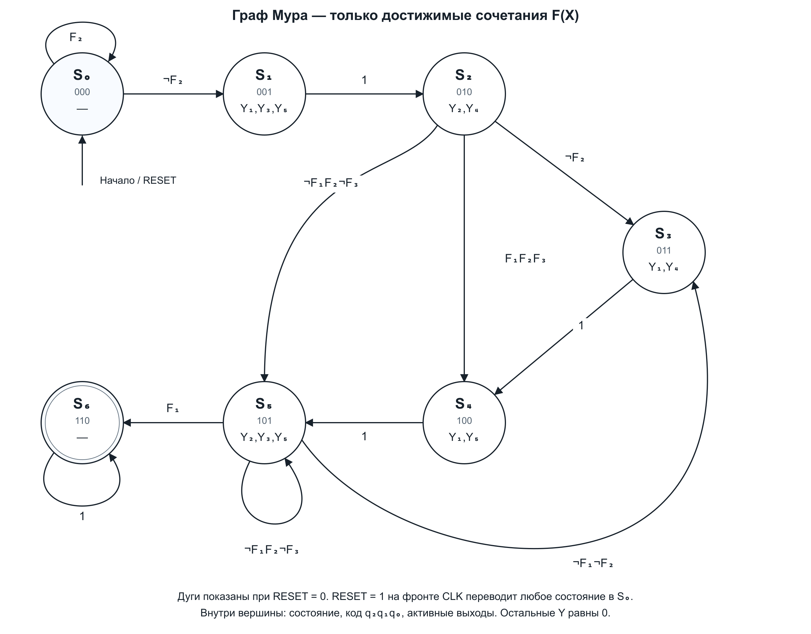

## Учебный циклический граф Мура

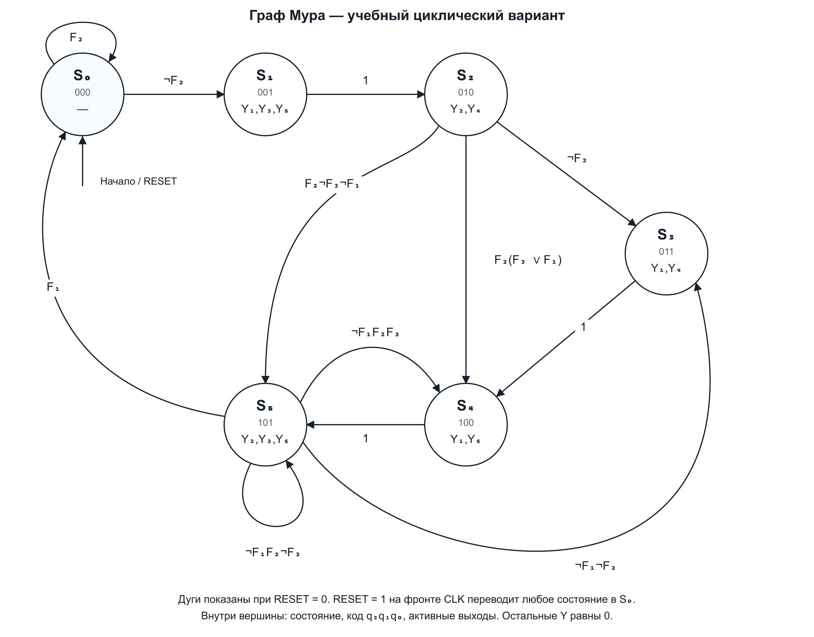

## Карта Карно F1

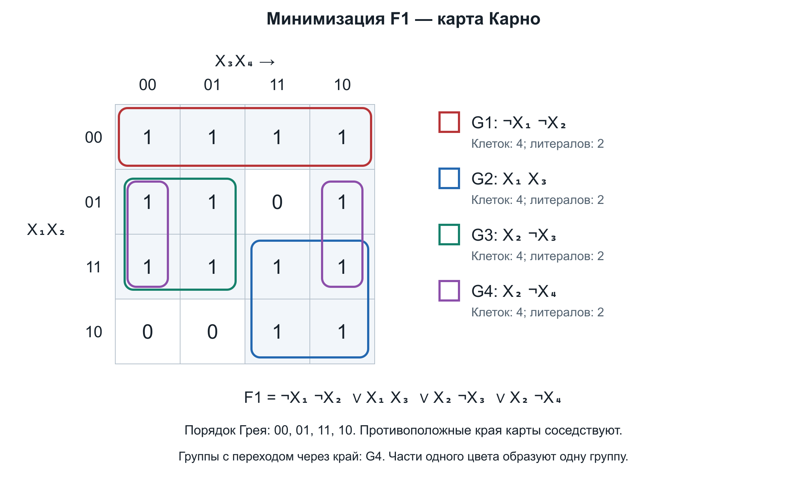

## Карта Карно F2

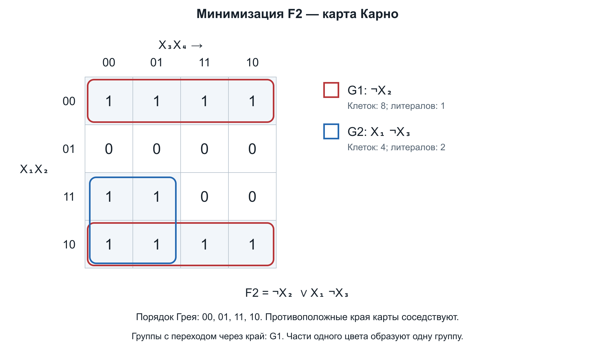

## Карта Карно F3

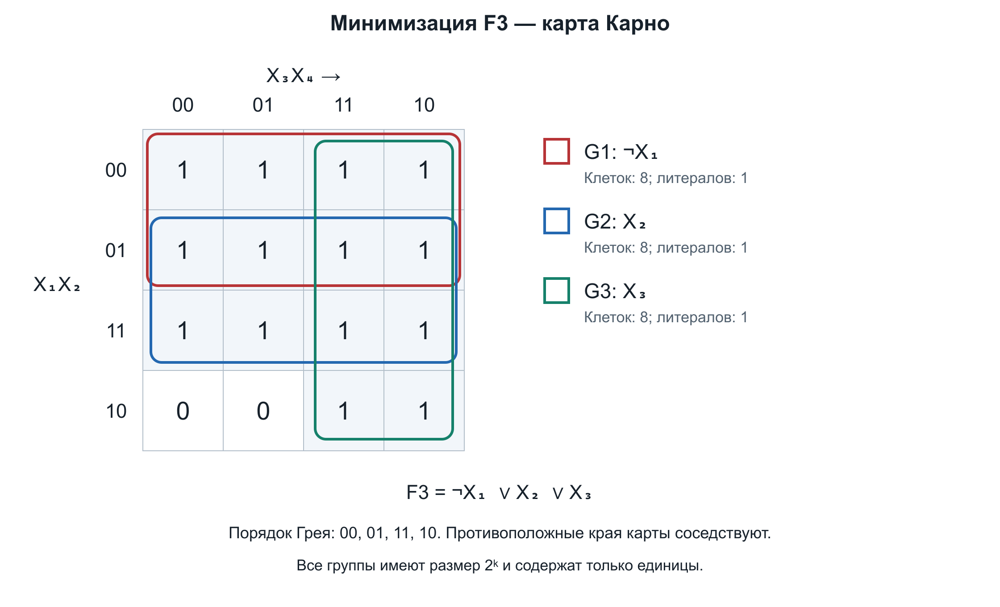

## Схема формирования F1,F2,F3

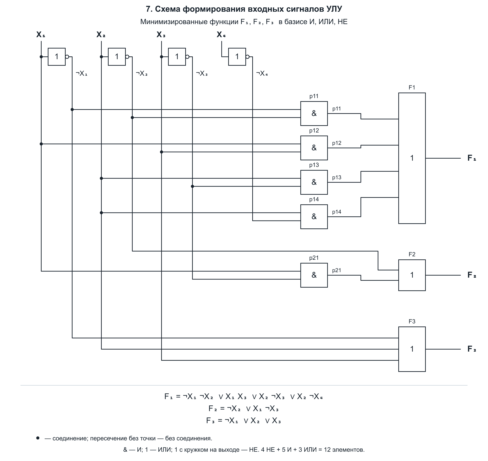

## Общая аппаратная схема

## Дешифратор состояний

## Аппаратная реализация управляющего автомата УЛУ — таблица

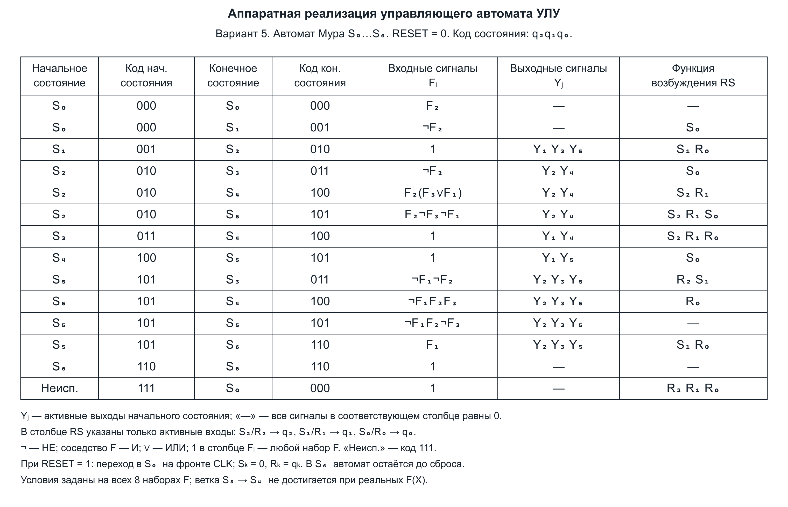

## Логика переходов

## Функции возбуждения RS и альтернативные D

## Три синхронных RS-триггера

## Формирование Y и DONE

## Временная диаграмма тестового сценария

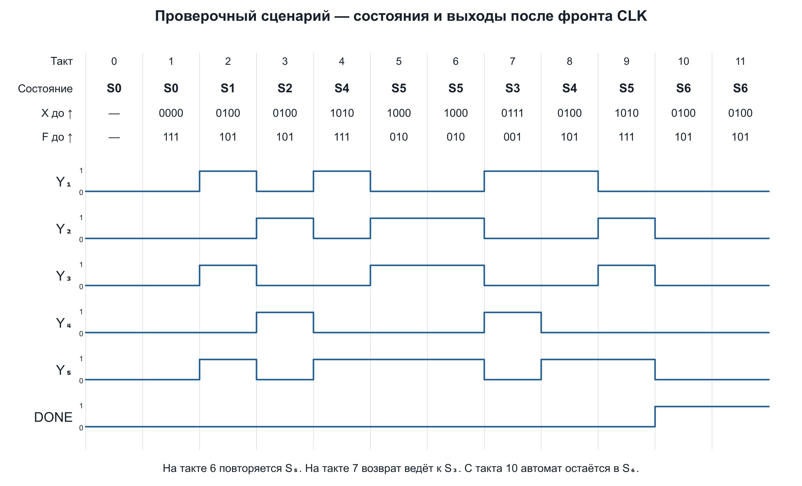
